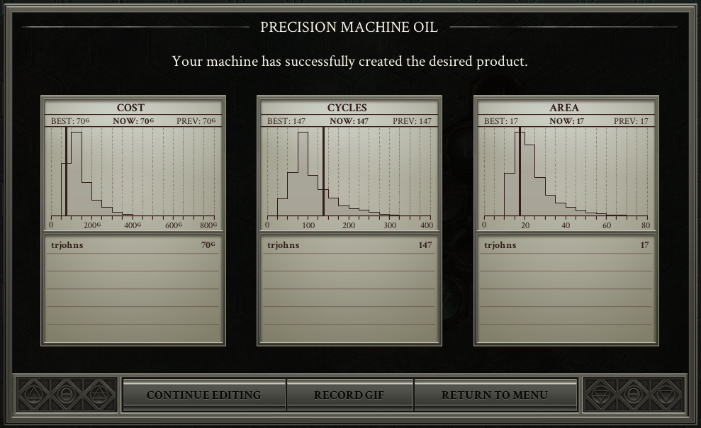

Course material for Dr. Johnson's *Statistical Methods* (Stat 251, Section 01) at the University of Idaho for the fall semester of 2021.

***

See the [University of Idaho COVID-19 Vaccine information page](https://www.uidaho.edu/vandal-health-clinic/coronavirus/vaccine) for how to get vaccinated. 

<!--  -->
<!--  -->
<!--  -->
<!--  -->
<!--  -->
<!--  -->
<!--  -->
<!--  -->
<!--  -->
<!--  -->
<!--  -->
<!--  -->
<!--  -->
<!--  -->
<!--  -->
<!--  -->
<!--  -->
<!--  -->
<!--  -->
<!--  -->
<!--  -->
<!--  -->
<!--  -->
<!--  -->
<!--  -->
<!--  -->

<!-- 

<!--  -->

<!--   -->

<!-- My solution to the "Precision Machine Oil" puzzle in the game [Opus Magnum](https://en.wikipedia.org/wiki/Opus_Magnum_(video_game)). The histograms show the distribution of cost, number of cycles, and area for solutions by other players (my solution is shown by the vertical line).   -->

<!-- You may be familiar with some of [Timothée Chalamet's](https://en.wikipedia.org/wiki/Timoth%C3%A9e_Chalamet) filmography (I'm looking forward to seeing how he does in the new [Dune](https://youtu.be/w0HgHet0sxg) movie because I'm a fan of [Frank Herbert's](https://en.wikipedia.org/wiki/Frank_Herbert) books), but have you seen his early work? -->

<!-- 
 -->

<!-- <iframe width="560" height="315" src="https://www.youtube.com/embed/BvWefB4NGGI" frameborder="0" allow="accelerometer; autoplay; encrypted-media; gyroscope; picture-in-picture" allowfullscreen></iframe> -->

<!-- Apparently he enjoyed his statistics course. -->
