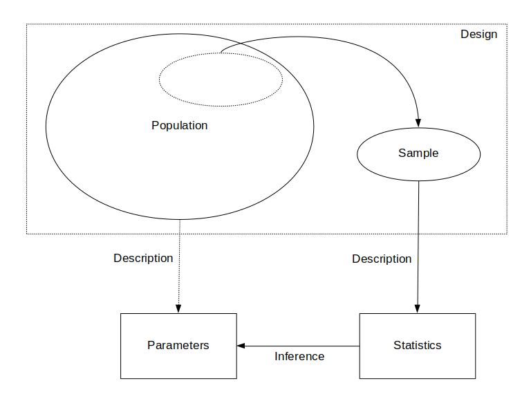

---
output:
  html_document: 
    theme: readable
  pdf_document: default
---

```{r, echo = FALSE, message = FALSE}
library(lubridate)
date <- "01-11-2023"
weekday <- wday(mdy(date), label = TRUE, abbr = FALSE)
month <- month(mdy(date), label = TRUE)
day <- day(mdy(date))
```

---
title: `r paste(weekday, ", ", month, " ", day, sep = "")`
output:
  html_document: 
    theme: readable
  pdf_document: default
header-includes:
  - \usepackage{float}
  - \usepackage{booktabs}
---

```{r setup, include = FALSE}
knitr::opts_chunk$set(echo = FALSE, message = FALSE, out.width = "100%", fig.align = "center", cache = FALSE, dev = ifelse(knitr::is_html_output(), "png", "pdf"))
```

```{r packages}
library(tidyverse)
suppressWarnings(library(kableExtra))
```

```{r utilities}
source("../../utilities.R")
```

`r ifelse(knitr::is_html_output(), paste("You can also download a [PDF](lecture-", date, ".pdf) copy of this lecture.", sep = ""), "")`

## The "Anatomy" of (Typical) Data

What do data look like?

**Example**: The following are fictional data consisting of 20 observations of the Hobbits attending a party at the Prancing Pony Inn in the town of Bree.

```{r}
set.seed(123)
dm <- read.table(text = " 
Arbogastes Goodwort
Britius Thornburrow
Hamfast Fleetfoot
Polo Chubb-Baggins
Berengar Longbottom
Meginhard Galpsi
Fulrad Boffin
Fortinbras Boffin
Sigefroy Roper
Dado Zaragamba")
df <- read.table(text = "
Ingunde Proudfoot
Taryn Zaragamba
Vuldretrada Mugwort
Bailey Hedgehopper
Rose Smallburrow
Merofled North-took
Duenna Undertree
Asphodel Swiftfoot
Daisy Townsend
Madeline Underfoot")
dm <- apply(dm, 1, function(x) paste(x, collapse = " "))
df <- apply(df, 1, function(x) paste(x, collapse = " "))
d <- data.frame(Observation = 1:20, Name = c(dm, df))
d$Farthing <- sample(c("North","South","East","West"), 20, replace = TRUE)
d$Height <- rnorm(20, 0.915, 0.1)
d$Height <- round(d$Height * 100)
d$Height <- paste(d$Height, "cm")
d$include <- sample(rep(0:1, c(15,5)))
ktbl(d[,1:4], align = "clcc")
```

**Example**: The following are data from a study by Charles Darwin that compared the heights of seedlings produced by cross-fertilization versus self-fertilization.[^darwin] Each observation is the heights (in inches) of a pair of seedlings from two flowers on the same parent plant, as well as the difference in the heights. 
```{r}
HistData::ZeaMays %>% mutate(Obs = 1:n()) %>% select(Obs, cross, self, diff) %>% 
  rename(Cross = cross, Self = self, Difference = diff) %>% 
  ktbl() %>% add_header_above(c(" " = 1, "Fertilization" = 2, " " = 1))
```

The fundamental unit of data is the **observation** (one row of the table of data shown above). An observation is the set of values of one or more *variables*.

**Variables** are characteristics of the observation. One basic distinction is between **quantitative** (i.e., numerical) and **categorical** variables (i.e., qualitative). 

\pagebreak

## Samples and Populations

An important issue in statistics is that we often do not observe all possible observations. 

A **sample** is the set of *observed* observations.

A **population** is the set of *all possible* observations --- both observed and unobserved. A population can be *real* and *finite* (e.g., most surveys), or *hypothetical* and *infinite* (e.g., laboratory studies). 

Note: Sometimes the sample and population are defined in terms of the *objects* (e.g., Hobbits, seedling pairs) on which the observations are made. This is particularly true in surveys. But for greater generality we will define samples and populations in terms of observations. 

**Example**: The observations in black below are the observed observations (i.e., the sample). The observations in grey below are the unobserved observations. We might define all 20 observations as the population.
```{r}
knitrformat <- function() {
  ifelse(knitr::is_html_output(), "html", "latex")
}

d %>% mutate(
  Obs = cell_spec(Observation, knitrformat(), color = ifelse(include, "black", "lightgray")),
  Name = cell_spec(Name, knitrformat(), color = ifelse(include, "black", "lightgray")),
  Farthing = cell_spec(Farthing, knitrformat(), color = ifelse(include, "black", "lightgray")),
  Height = cell_spec(Height, knitrformat(), color = ifelse(include, "black", "lightgray"))) %>% 
  select(Observation, Name, Farthing, Height) %>% 
  kable(format = knitrformat(), align = "clcc", booktabs = TRUE, escape = FALSE) %>% 
  kable_styling(full_width = FALSE)
```

The population includes $N$ = 20 observations. The sample (also shown below) contains $n$ = 5 observations. The symbols $N$ and $n$ are called the *size* of the population and sample, respectively (i.e., the number of observations in the population or sample). 

```{r}
d %>% filter(include == 1) %>% mutate(Observation = 1:n()) %>% 
  select(Observation, Name, Farthing, Height) %>% ktbl(align = c("clcc"))
```

**Example**: Consider a rectangular-shaped piece of land that has been divided into 100 smaller rectangular units, each containing something of interest (e.g., trees, burrows, archaeological artifacts). A subset of 10 of those smaller units was selected and the number of objects in each of these units was counted.
```{r, fig.height = 5, fig.width = 5}
g <- function(M, N, n, a1 = 1, b1 = 1, a2 = 1, b2 = 1, ps = 101, ss = 102, plot = TRUE) {
  set.seed(ps)
  x <- rbeta(M, a1, b1) * sqrt(N)
  y <- rbeta(M, a2, b2) * sqrt(N)
  par(mai = c(0,0,0,0))
  if (plot) {
    plot(x, y, bty = "n", xlim = c(0, sqrt(N)), xaxt = "n", yaxt = "n",
      ylim = c(0, sqrt(N)), xlab = "", ylab = "", pch = 16, cex = 0.25)
    for (i in 1:(sqrt(N) + 1)) {
      lines(c(i-1,i-1), c(0, sqrt(N)), lty = 3)
      lines(c(0, sqrt(N)), c(i-1,i-1), lty = 3)
    }
  }
  
  x <- cut(x, breaks = 0:sqrt(N), labels = FALSE)
  y <- cut(y, breaks = 0:sqrt(N), labels = FALSE)
  
  d <- expand.grid(x = 1:sqrt(N), y = 1:sqrt(N), f = NA)
  set.seed(ss)
  d$z <- sample(rep(c(0, 1), c(N-n, n)))
  for (i in 1:sqrt(N)) {
    for (j in 1:sqrt(N)) {
      d$f[d$x == i & d$y == j] <- sum(x == i & y == j)
    }
  }
  if (plot) {
    for (i in 1:sqrt(N)) {
      for (j in 1:sqrt(N)) {
        if (d$z[d$x == i & d$y == j]) {
          polygon(c(i - 1, i, i, i - 1), c(j - 1, j - 1, j, j), lwd = 2)
          #text(i - 0.5, j - 0.5, d$f[d$x == i & d$y == j])
        }
      }
    }
  }
  d
}
M.site <- 1000
N.site <- 100
n.site <- 10
out <- g(M.site, N.site, n.site, ss = 123, plot = TRUE)
```
Here we have a population size of $N$ = 100 and a sample size of $n$ = 10. 

**Example**: Consider Charles Darwin's study of the difference in height of corn seedlings produced from cross-fertilization verses self-fertilization. There were two seedlings from each plant --- one from a seed produced by cross-fertilization, and another from a seed produced by self-fertilization 
```{r}
set.seed(123)
d <- as.data.frame(with(HistData::ZeaMays, cbind(pair, cross, self)))
names(d) <- c("Obs", "Cross", "Self")
d.bottom <- data.frame(Obs = 16:18, 
  Cross = round(rnorm(3, mean(d$Cross), sd(d$Cross))) + sample(seq(0, 0.875, by = 0.125), 3, replace = TRUE),
  Self = round(rnorm(3, mean(d$Self, sd(d$Self)))) + sample(seq(0, 0.875, by = 0.125), 3, replace = TRUE))
d <- rbind(d, d.bottom)
d$Obs <- c(as.character(d$Obs))
d$Diff <- c(format(d$Cross - d$Self, nsmall = 3))
d$Cross <- c(format(d$Cross, nsmall = 3))
d$Self <- c(format(d$Self, nsmall = 3))
d <- rbind(d, c("", "", "", ""))
d <- d %>% mutate(
  Obs = cell_spec(Obs, knitrformat(), color = rep(c("black", "lightgray"), c(15, 4))),
  Cross = cell_spec(Cross, knitrformat(), color = rep(c("black", "lightgray"), c(15, 4))),
  Self = cell_spec(Self, knitrformat(), color = rep(c("black", "lightgray"), c(15, 4))),
  Diff = cell_spec(Diff, knitrformat(), color = rep(c("black", "lightgray"), c(15, 4)))
)
ktbl(headtail(d,18)) %>% add_header_above(c(" " = 1, "Height" = 2, " " = 1))
```

Note that here the sample size is $n$ = 15, but the population size is effectively infinite (i.e., $N$ = $\infty$).

[^darwin]: Darwin, C. (1876). *The Effect of Cross- and Self-fertilization in the Vegetable Kingdom, 2nd Ed*. London: John Murray.

<!-- Maybe try introducing the concepts of statistic and parameter *after* introducing the concept of a distribution, so that they can be defined as describing a distribution? Actually maybe re-introduce these concepts and refine their definition. -->

\pagebreak

## Statistics and Parameters

A **statistic** is a description of the observations in a *sample*. 

A **parameter** is a description of the observations in a *population*. 

Note: More formally, a statistic is anything that is a *function of the observations in a sample*, and a parameter is a *function of the observations in a population*.

## Descriptive and Inferential Statistics

**Descriptive statistics** concerns *describing* the observations in a *sample* using *statistics*, or a *population* using *parameters*. 

**Inferential statistics** (or **statistical inference**) concerns using a *sample* (usually a *statistic*) to make conclusions about a *population* (usually a *parameter*).

## The "Big Picture"
  
The "big picture" illustrates the roles of population versus sample, design, parameter versus statistic, and description versus inference. The **design** of a study is the process of how we obtain a sample --- i.e., how we *collect* data (more on that later).

