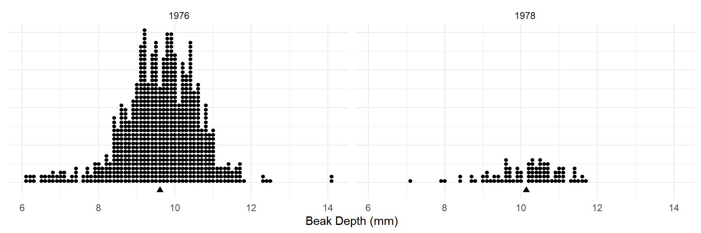
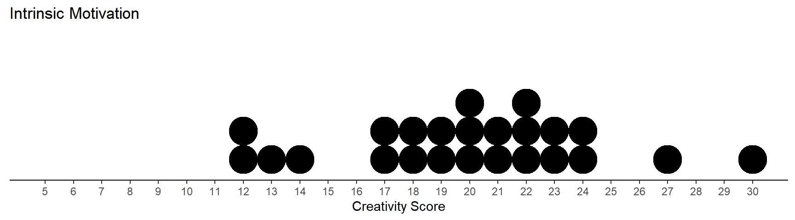
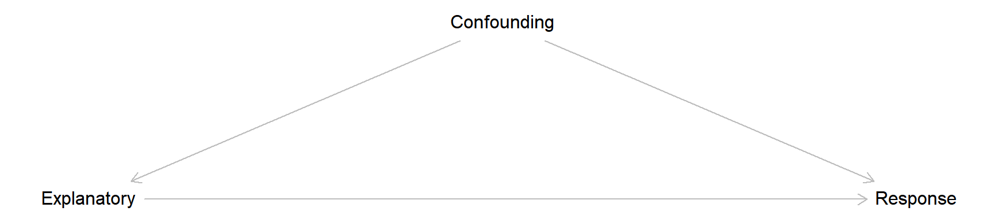
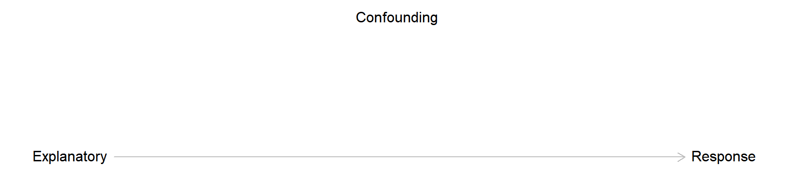
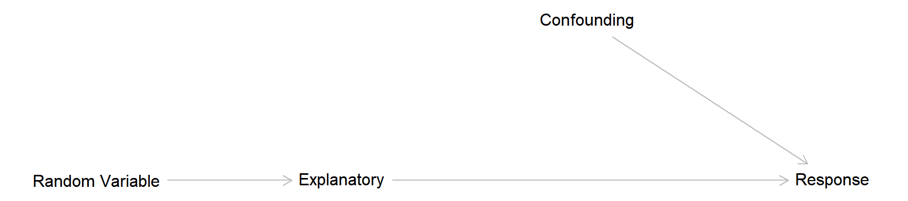
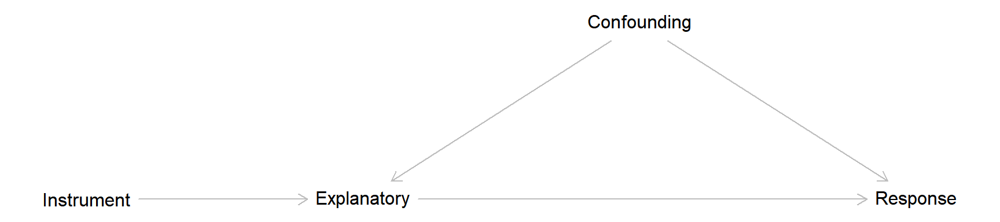
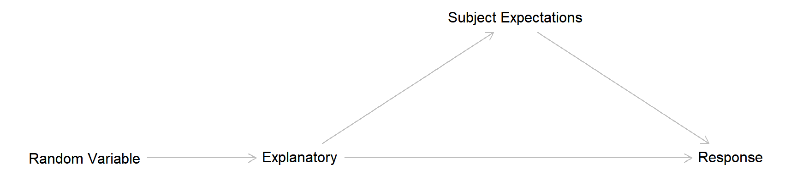
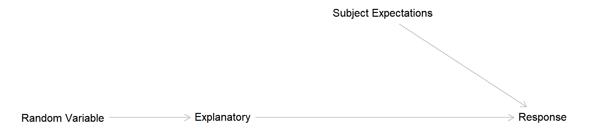
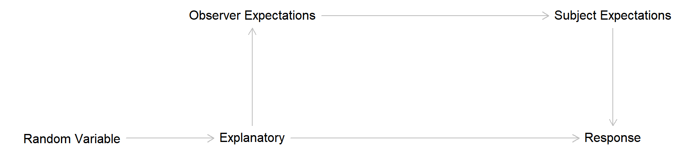

---
output:
  html_document:
    theme: readable
---

---
title: Friday, Nov 5
header-includes:
  - \usepackage{array}
  - \usepackage{booktabs}
---

You can also download a [PDF](lecture-11-05-2021.pdf) copy of this lecture.

## Explanatory and Response Variables

Frequently when looking at the relationship between two variables we consider the *distribution* of a **response variable** (also known as a ["dependent variable"](dependentvariable.jpg)) for *each value* of an **explanatory variable** (also known as an "independent variable"). The question we often have is if/how does the *distribution* of the response variable change when the *value* of the explanatory variable changes.

**Example**: Dot plots of samples of observations of beak size from before (1976) and after (1978) a drought in 1977.

What are the response and explanatory variables?

**Example**: Creative writing students were "primed" with either extrinsic or intrinsic motivation. They were then asked to write a poem in the Haiku style about laughter. Each poem was then scored for "creativity" on a 40-point scale by judges.

What are the response and explanatory variables?

## Average Treatment Effect

Sometimes our goal is to estimate the **average treatment effect**, which is the average change in the **response variable** *caused* by changing the **explanatory variable** from one value to another. 

The difference $\mu_1-\mu_2$ or $p_1-p_2$ is the average treatment effect *provided that the difference between the parameters is not, in part, caused by any confounding variables*.  

## Confounding Variables

<!-- Examples: Exposure to violent media and violent behavior, smoking and FEV. -->

A **confounding variable** is a variable with a causal effect on both the explanatory and response variables. 

Failure to deal with confounding variables can result in a biased estimate of the average treatment effect. Three methods of dealing with confounding variables are *conditioning*, *randomization*, and *instrumental variables*. 

\pagebreak

### Conditioning

<!-- Examples: Smoking and FEV. -->

By **conditioning** we "hold constant" the confounding variable when estimating the average treatment effect. If the confounding variable is constant it cannot have a causal effect on the explanatory or response variables. 

\pagebreak

### Randomization

<!-- Examples: Smoking and FEV, antidepressant drug trial. -->

With **randomization** we allow *only* a random variable (e.g., coin flip, dice roll) to have a causal effect the explanatory variable. Then any confounding variables cannot have a causal effect the explanatory variable.

The presence of randomization is often used to distinguish between *(randomized) experiments* and *observational studies*.

In an **experiment** the researchers control the value of the explanatory variable, typically through the use of randomization.

In an **observational study** the researchers do not control the value of the explanatory variable.

\pagebreak

### Instrumental Variable

<!-- Example: Encouragement design with job training, SI session attendance, reminders. -->

An **instrumental variable** is a variable that has a causal effect the explanatory variable, but does not (directly) have a causal effect on the response variable, and does not affect and is not affected by any confounding variables.

The treatment effect can then be adjusted to "remove" the effect of any confounding variables. 

\pagebreak

## Direct Versus Indirect Effects

Causal effects of an explanatory variable on a response variable can be *direct* and *indirect*. It is sometimes important to be able to distinguish between these two kinds of effects. Two examples of indirect effects are the *placebo effect* and the *observer-expectancy effect*. 

### Placebo Effect

<!-- Examples: Depression drug trial, educational psychology (material delivery method). -->

<!-- A nice example would be in the Covid-19 vaccine trials. Why use a placebo (saline) for a vaccine? If someone knows they received the vaccine, they may engaged in more risky behavior, while if someone knows they did not receive the vaccine, they may engage in less risky behavior. This would lead to an underestimate of the efficacy of the vaccine. -->

The **placebo effect** can be characterized by an *indirect* causal effect of the explanatory variable on subject expectations, which in turn has a causal effect on the response variable.

Use of a **single-blind** can eliminate the indirect causal effect of the explanatory variable through subject expectation, so the causal effect of the explanatory variable is only *direct*. 

\pagebreak

### Observer-Expectancy Effect

<!-- Examples: Depression drug trial, educational psychology (different delivery methods).  -->

The **observer-expectancy effect** is when the explanatory variable has a causal effect on the expectations of the observer, which in turn has a causal effect on the response variable. 

This effect can also occur when the observer expectation has a causal effect on the subject expectation, which then has a causal effect on the response variable.

Use of a **double-blind** can eliminate the indirect causal effect of the explanatory variable on observer expectations, so the causal effect of the explanatory variable is only *direct*. 

