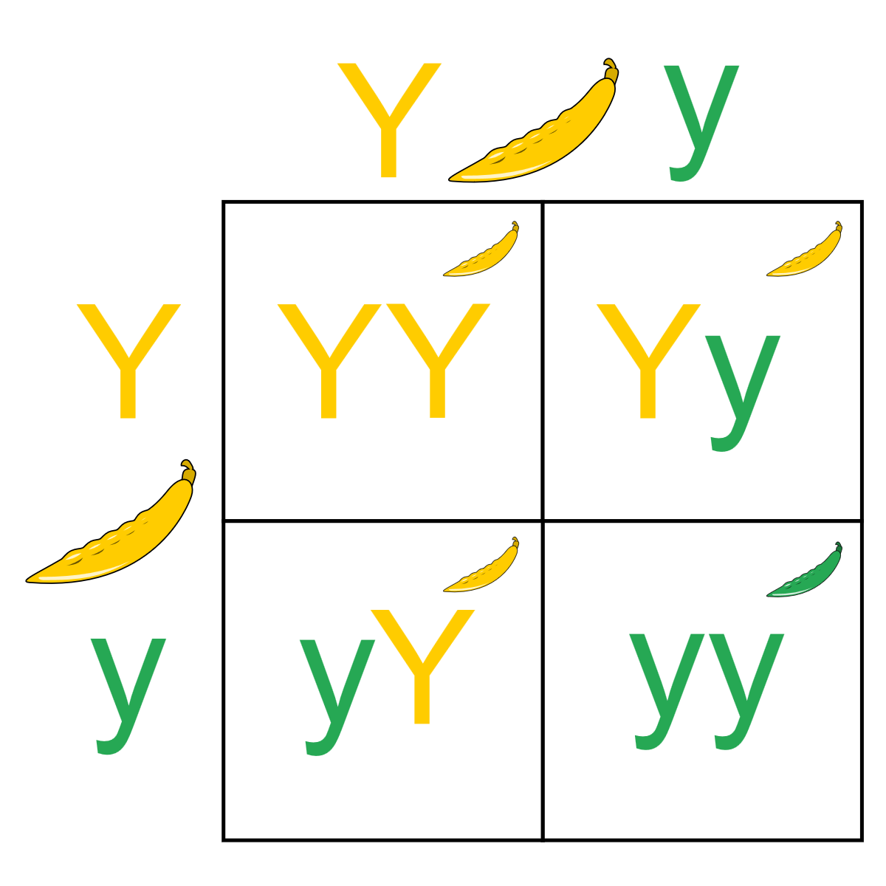

---
output:
  html_document:
    theme: readable
---

```{r, echo = FALSE, message = FALSE}
library(lubridate)
date <- "11-15-2021"
weekday <- wday(mdy(date), label = TRUE, abbr = FALSE)
month <- month(mdy(date), label = TRUE)
day <- day(mdy(date))
```

---
title: `r paste(weekday, ", ", month, " ", day, sep = "")`
header-includes:
  - \usepackage{array}
  - \usepackage{booktabs}
---

```{r setup, include = FALSE}
knitr::opts_chunk$set(echo = FALSE, message = FALSE, fig.align = "center", out.width = "100%", fig.width = 9, cache = FALSE, dev = ifelse(knitr::is_html_output(), "png", "pdf"))
```

```{r packages}
library(dplyr)
library(tidyr)
library(ggplot2)
library(kableExtra)
```

```{r utilities}
source("../../utilities.R")
```

`r ifelse(knitr::is_html_output(), paste("You can also download a [PDF](lecture-", date, ".pdf) copy of this lecture.", sep = ""), "")`

## Mendel's Pea Experiment

[Gregor Mendel](https://en.wikipedia.org/wiki/Gregor_Mendel) conducted a study in which he crossed pea plants. The plants he crossed had the *alleles* (i.e., a form or version of a gene) for both yellow and green peas --- a trait controlled by a single locus. He believed two of his laws applied here: the *Law of Segregation* and the *Law of Dominance*. These laws would determine the *probabilities* of certain genotypes. This can be summarized by a [Punnett square](https://en.wikipedia.org/wiki/Punnett_square) diagram.

```{r, out.width = '60%'}

```

If Mendel's Laws are true, what do they imply about the probability distribution for these four outcomes (i.e., YY, Yy, yY, or yy)? And what does this imply about the probability distribution of color (i.e., yellow or green).

Mendel bred 8023 offspring. Of these 6022 were yellow, and 2001 were green. Do his laws "fit" the data? That is, does the trait of color in pea plants exhibit what we would call [Mendelian inheritance](https://en.wikipedia.org/wiki/Mendelian_inheritance)? 

\pagebreak

## Observed and Expected Counts

**Observed Count**: The number of times an event has been *observed* out of a sample size of $n$.

**Expected Count**: The mean of the population distribution of the observed count. It can be computed as $n \times p$ where $p$ is the *probability* of the event. 

**Example**: What are the observed and expected counts for Mendel's pea study?

\pagebreak

## The $X^2$ (Chi-Squared) Test Statistic

The discrepancy between the observed and expected counts can be measured using the $X^2$ test statistic defined as
$$
  X^2 = \sum \frac{(\text{observed count} - \text{expected count})^2}{\text{expected count}}.
$$
**Example**: What is the value of $X^2$ based on the observed and expected counts for Mendel's pea study?

\pagebreak

## The $\chi^2$ Distribution

If the expected counts are correct --- i.e., if the probabilities are correct --- the the $X^2$ test statistic has (approximately) a $\chi^2$ distribution. 
```{r, fig.height = 4}
par(mfcol = c(1,2), cex = 0.7)
x <- rep(NA, 10000)
for (i in 1:length(x)) {
  data <- sample(1:2, 6022 + 2001, replace = TRUE, prob = c(0.75,0.25))
  x[i] <- chisq.test(table(data), p = c(0.75, 0.25))$statistic
}
hist(x, breaks = 80, xlab = "Chi-Squared Test Statistic", main = "", xlim = c(0,8), ylab = "Frequency")
title("Empirical Approximation")
x <- seq(0, 8, length = 1000)
plot(x, dchisq(x, df = 1), type = "l", bty = "n",
     xlab = "Chi-Squared Test Statistic", ylab = "Probability Density")
title("Mathematical Approximation")
```
The degrees of freedom varies, depending on how the expected counts are computed. For a goodness-of-fit test, it may be one less than the number of possible events, but it sometimes less than that if expected counts must be *estimated*.

\pagebreak

## The Goodness-of-Fit Test

1. State your hypotheses in terms of probabilities.
2. Check the sample size --- all expected counts should be at least 5.
3. Compute the $X^2$ test statistic.
4. Compute the $p$-value.
5. Make a decision.

\pagebreak

## The Significance Test for a Single Proportion

Consider a test of the hypotheses $H_0\!: p = 0.75$ versus $H_a\!: p \neq 0.75$. The test statistic would be 
$$
  z = \frac{6022/8023 - 0.75}{\sqrt{0.75(1-0.75)/8023}} \approx 0.122.
$$
How is this related to the test using the $X^2$ test statistic? What is the limitation of the $z$ test statistic relative to the $X^2$ test statistic? 

\pagebreak

## Hardy-Weinburg Equilibrium of Scarlet Tiger Moths

The Hardy-Weinburg Principle states that *allele and genotype frequencies in a population will remain constant from generation to generation in the absence of other evolutionary influences*. When this is true we say that they are at an *equilibrium*. More precisely, the *probabilities* that will be constant, and we can *compute* these probabilities with some simple equations.  

**Example**: A sample of $n$ = 1612 Scarlet tiger moths were classified with respect to phenotype (trait) of the spotting on their wings.
```{r}
d <- data.frame(Phenoytype = c("white-spotted (AA)", "intermediate (Aa,aA)", "little spotting (aa)"), 
  Probability = c("$\\pi^2$","$2\\pi(1-\\pi)$","$(1-\\pi)^2$"),
  Observed = c(1469,138,5), Expected = c(1467.4,141.2,3.4))
ktbl(d, align = c("lccc")) %>% add_header_above(c(" " = 1, " " = 1, "Counts" = 2))
```
Note that the three expected counts are computed as $n\pi^2$, $n2\pi(1-\pi)$, and $n(1-\pi)^2$. Here $\pi$ represents the probability of the A allele, which can be estimated as 
$$
  \hat\pi = \frac{2 \times 1469 + 138}{2 \times 1612} \approx 0.9541.
$$
Replacing $\pi$ with $\hat\pi$ = 0.9541 in the equations above we can *estimate* the probability of each phenotype, and then *estimate* the expected counts.

Does the hypothesis that the population is at equilibrium fit the data?

\pagebreak

## The Mendelian Paradox

When Mendelian inheritance was true of particular trait, Mendel's laws fit his data well, *but maybe a little too well*. This is known as the [Mendalian paradox](https://en.wikipedia.org/wiki/Gregor_Mendel#The_Mendelian_Paradox).
```{r, fig.height = 4}
par(mai = c(0.8,0,0,0))
trait <- c("form of seed", "color of cotyledon","color of seed coat",
"form of pods","color of unripe pods","position of flowers","length of stem")
o1 <- c(5474,6022,705,882,428,651,787)
o2 <- c(1850,2001,224,299,152,207,277)
x <- rep(NA, 7)
p <- rep(NA, 7)
for (i in 1:7) {
  x[i] <- chisq.test(c(o1[i],o2[i]), p = c(0.75,0.25), correct = FALSE)$statistic
  p[i] <- 1-pchisq(x[i], df = 1)
}
d <- data.frame(Trait = trait, Counts = paste(o1, o2, sep = ", "), Statistic = round(x,2), Pvalue = round(p,2))
names(d)[3:4] <- c("$X^2$","$p$-value")
ktbl(d, align = "lccc")
z <- seq(0, 2, length = 1000)
plot(z, dchisq(z, df = 1), type = "l", xlab = "Test Statistic", ylab = "", yaxt = "n", bty = "n")
par(mai = c(0.7,0,0,0))
points(x, rep(0, 7), pch = 16)
```
The mean of the $\chi^2$ distribution equals its degrees of freedom (which is one for all of these studies), and the median is approximately 0.455. All of these studies produced test statistics that are below average, and all but one produced test statistics that were below the median. Is that suspicious? 
